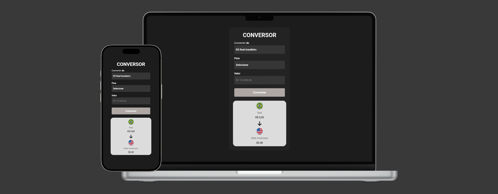

# Primeiro Conversor de Moedas

## Descrição
Este é um simples conversor de moedas que permite converter valores de Real (BRL) para outras moedas, como Dólar Americano (USD), Euro (EUR) e Libra Esterlina (GBP).
**[Link do projeto](https://davirrocha.github.io/coinConverter/)**

## Tecnologias Utilizadas
- HTML5

- CSS3

- JavaScript

